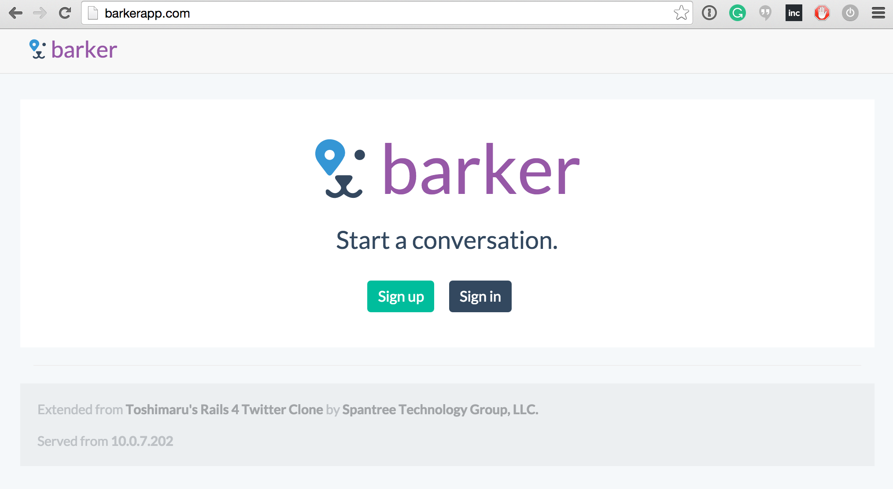
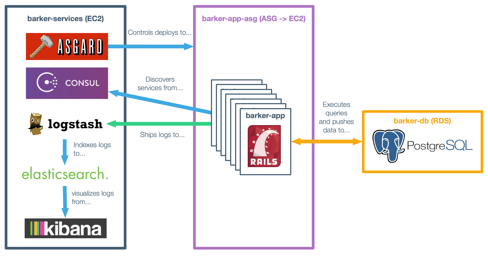

## What is Barker?

Barker is a Rails 4-based Twitter clone originally created by [Toshimaru](https://github.com/toshimaru/Rails-4-Twitter-Clone) to demonstrate how to build a basic Ruby on Rails application using the popular [Ruby on Rails Tutorial](http://ruby.railstutorial.org/ruby-on-rails-tutorial-book). The original project has been extended by [Spantree Technology Group, LLC](http://spantree.net) to show to to transform an traditional web application to support high availability on the cloud.

## Toolchain

To achieve high availability, we use a number of open-source and cloud-based tools, such as:

* [Consul](http://consul.io) for fault-tolerant and datacenter-aware service discovery, see [Diplomat](https://github.com/Spantree/barker/blob/5b409b914396e824a4b58aeed85d11cc24a8ba54/config/application.rb#L42-L57), [database](https://github.com/Spantree/barker/blob/5b409b914396e824a4b58aeed85d11cc24a8ba54/config/database.yml#L28-L38) and [docker-compose](https://github.com/Spantree/barker/blob/570a297e695196f0321e982e5751d710db5a6664/docker-compose.yml#L7-L10) configurations.
* [ELK](https://www.elastic.co/webinars/introduction-elk-stack) for distributed log aggregation, see [Rails logging](https://github.com/Spantree/barker/blob/5b409b914396e824a4b58aeed85d11cc24a8ba54/config/application.rb#L50-L56) and [docker-compose](https://github.com/Spantree/barker/blob/570a297e695196f0321e982e5751d710db5a6664/docker-compose.yml#L11-L17) configurations.
* [Packer](http://packer.io) for automated immutable AMI creation, see [packer](packer/) folder and [image provisioning shell scripts](system/scripts).
* [CircleCI](http://circleci.com) for continuous integration, see [circle.yml](circle.yml) file and [ci scripts](https://github.com/Spantree/barker/tree/develop/ci).
* [Netflix Asgard](https://github.com/Netflix/asgard) for zero-downtime rolling deployments to AWS, see [docker-compose](https://github.com/Spantree/barker/blob/570a297e695196f0321e982e5751d710db5a6664/docker-compose.yml#L18-L20) and [plugin](https://github.com/Spantree/barker/tree/develop/system/asgard) configurations.
* [Gatling](http://gatling.io) for stress testing, see [stress_tests](stress_tests) folder.

## Continuous Integration Workflow

Leveraging Github, CircleCI and Packer, we're able to go straight from developers pushing changes into Github into a deployable Amazon Machine Image (AMI):

## Infrastructural Components

One the AMI is created, we also leverage Netflix's Asgard and a number of other tools to support continuous deployment, service discovery and log aggregation:

## Presentation

There is an accompanying browser-based slide deck that walks through the motivations for this project and its architecture [here](http://bit.ly/hacloudapps).

## Attributions

* Toshimaru's Original [Rails 4 Twitter Clone](https://github.com/toshimaru/Rails-4-Twitter-Clone)
* TANABE Ken-ichi's [Circle CI Packer Example](https://github.com/nabeken/circleci-packer-example)
* [Jeff Smith's](https://twitter.com/jeffksmithjr) high-availability french bulldog illustrations
* [Paul Saskin](https://dribbble.com/shots/1074140-Pin-dog) "Pin Dog" concept mark